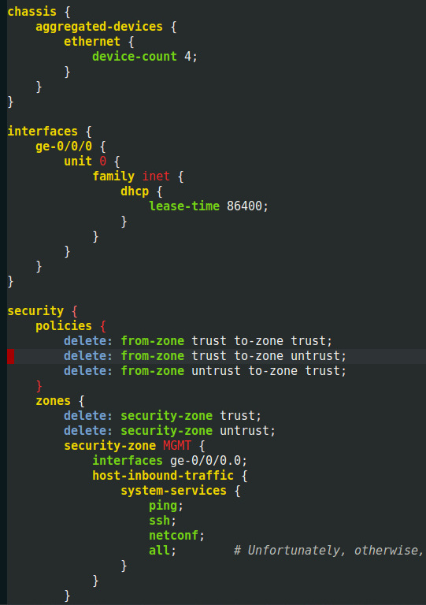

# Mode for JunOS configuration files

This features `junos-mode` a mode for editing JunOS-like files.

There is currently no configuration knob.

## Integration with org-mode and Babel

It also comes with an integration with org-mode and Babel. It uses a
small Python helper to efficiently handle several parallel sessions
asynchronously. This helper
uses [Junos PyEZ](https://github.com/Juniper/py-junos-eznc).

    #+BEGIN_SRC junos :host alfred.exoscale.local
    system {
        time-zone Europe/Paris;
    }
    #+END_SRC
    
    #+RESULTS:
    #+begin_example
    Load replace: ✓
    Checks: ✓
    
    Differences
    ‾‾‾‾‾‾‾‾‾‾‾
       [edit system]
       -  time-zone Europe/Zurich;
       +  time-zone Europe/Paris;
       
    #+end_example
    
You can also execute CLI commands:

    #+BEGIN_SRC junos :host alfred.exoscale.local
    show version
    #+END_SRC
    
    #+RESULTS:
    #+begin_example
       
       fpc0:
       --------------------------------------------------------------------------
       Hostname: alfred
       Model: qfx5100-48s-6q
       Junos: 14.1X53-D35.3
       JUNOS Base OS Software Suite [14.1X53-D35.3]
       JUNOS Base OS boot [14.1X53-D35.3]
       JUNOS Online Documentation [14.1X53-D35.3]
       JUNOS Crypto Software Suite [14.1X53-D35.3]
       JUNOS Kernel Software Suite [14.1X53-D35.3]
       JUNOS Packet Forwarding Engine Support (qfx-ex-x86-32) [14.1X53-D35.3]
       JUNOS Routing Software Suite [14.1X53-D35.3]
       JUNOS SDN Software Suite [14.1X53-D35.3]
       JUNOS Enterprise Software Suite [14.1X53-D35.3]
       JUNOS Web Management Platform Package [14.1X53-D35.3]
       JUNOS py-base-i386 [14.1X53-D35.3]
       JUNOS Host Software [13.2X51-D38]
       
    #+end_example
    
There are some limitations with this integration. Notably, it expects
the output of the execution will be in a block, like above. If you
force another representation, this won't work as expected.

This is only compatible with with Org 9. It also requires
the [UUID module](https://github.com/nicferrier/emacs-uuid).

Note that the helper program is
using [Junos PyEZ](http://junos-pyez.readthedocs.io/) which doesn't
check SSH keys.

## Demo

See the following video for a live demo:

 - https://www.youtube.com/watch?v=e9sjhbxWJNE
 - https://www.youtube.com/watch?v=jCH-gO7RfFE
 - https://www.youtube.com/watch?v=L0G72g7R-xY

## License

> This file is free software; you can redistribute it and/or modify
> it under the terms of the GNU General Public License as published by
> the Free Software Foundation; either version 2, or (at your option)
> any later version.
>
> This file is distributed in the hope that it will be useful,
> but WITHOUT ANY WARRANTY; without even the implied warranty of
> MERCHANTABILITY or FITNESS FOR A PARTICULAR PURPOSE.  See the
> GNU General Public License for more details.
>
> You should have received a copy of the GNU General Public License
> along with GNU Emacs; see the file COPYING.  If not, write to
> the Free Software Foundation, Inc., 59 Temple Place - Suite 330,
> Boston, MA 02111-1307, USA.
